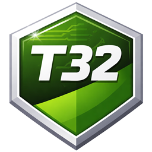

# The T32 Book

  
  

    A small, welcoming machine for learning assembly one clear step at a time.
  

Welcome. This book is a gentle introduction to **T32**, a tiny assembly language
and virtual machine with exactly **32 instructions**.

If assembly feels unfamiliar, that is completely fine. T32 is a nice place to
start because the machine is small enough to hold in your head, but still rich
enough to do real work. You get a single register, a stack, a data pointer, and
a 64 KiB memory tape. That is not much, and that is the point.

This book is written in the same spirit as a good tutorial language book:

- we start with intuition before details
- we prefer small examples over dense theory
- we explain what each instruction is for
- we keep the reference close at hand when you are ready for it

By the end, you should feel comfortable reading T32 programs, writing your own,
and understanding how a restricted instruction set can still be expressive.

## Who this is for

This book is for:

- people who are curious about assembly programming
- people who like tiny machines and elegant constraints
- people who want to learn by building and reading examples

You do not need prior assembly experience. A little patience and curiosity are
enough.

## What T32 gives you

T32 combines three useful ideas:

- a single 8-bit register called `A`
- a stack for temporary storage and subroutine calls
- a memory tape addressed through a 16-bit data pointer `DP`

That combination makes T32 feel smaller than a typical CPU, but more expressive
than an accumulator-only toy machine.

## How to read this book

If you are new to T32, read from the beginning. If you already know the basics,
skip ahead to the [instruction reference](./instruction-reference.md) or the
[examples](./examples.md).
